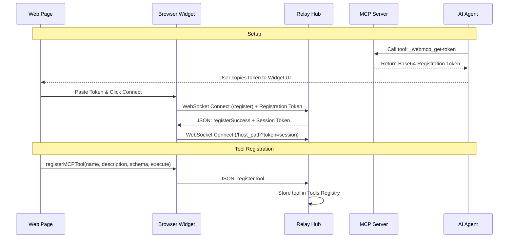
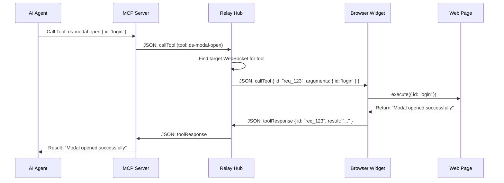

# WebMCP: Flow & Architecture Guide

WebMCP (Web Model Context Protocol) is a bridge that allows AI agents to interact directly with web applications. It transforms a standard web page into an "agent-aware" environment by exposing UI components as structured tools.

---

## 1. High-Level Architecture

The system consists of three main parts working together:

1.  **The Relay Hub (WebSocket Server)**: A central traffic controller that routes messages between the AI and the browser.
2.  **The MCP Server (Bridge)**: A standard Model Context Protocol server that talks to the AI Agent (like Antigravity) and relays requests to the Hub.
3.  **The Browser Widget (Client)**: A small script running inside your web page that registers tools and performs actual UI actions.

```mermaid
graph TD
    subgraph "AI Environment"
        A[AI Agent / Antigravity] <-->|MCP Protocol| B[MCP Server Bridge]
    end

    subgraph "Local Machine"
        B <-->|WebSocket /mcp| C[Relay Hub Port 9000]
    end

    subgraph "Browser"
        C <-->|WebSocket /{channel}| D[WebMCP Browser Widget]
        D <-->|JavaScript| E[Design System / Web App]
    end
```

---

## 2. Detailed Flow Diagrams

### A. Connection & Registration Flow
This flow happens when you first set up the connection between your browser and the AI.



### B. Tool Execution Flow
This flow happens when the AI decides to perform an action (like opening a modal).



---

## 3. File Breakdown

### Repository: `webmcp`

| File | Role | Description |
| :--- | :--- | :--- |
| `src/websocket-server.ts` | **The Hub** | The heart of the system. It runs the WebSocket server, manages connected browsers, and routes tool calls to the correct destination. |
| `src/server.ts` | **The Bridge** | Implements the MCP SDK. It translates AI requests into WebSocket messages for the Hub. |
| `src/webmcp.ts` | **The Widget** | The client-side logic. It creates the floating UI in the browser and handles communication back to the Hub. |
| `src/tokens.ts` | **Security** | Manages registration tokens and session validation to ensure only authorized connections are made. |
| `src/config.ts` | **Settings** | Configuration for ports, paths, and environment variables. |

### Repository: `portfolio-design-system`

| File | Role | Description |
| :--- | :--- | :--- |
| `src/webmcp/index.ts` | **Integration** | Provides the `registerMCPTool` utility. It detects the Hub and injects the widget script into the page. |
| `src/components/...` | **Implementation** | Components (like `ds-modal`) call `registerMCPTool` to expose their functionality to the AI. |

---

## 4. Authentication Mechanism

WebMCP uses a two-stage authentication process to ensure that only authorized users can bridge their AI agent to their local browser session.

### A. The Server Token (`WEBMCP_SERVER_TOKEN`)
*   **Purpose**: Authenticates the **MCP Server Bridge** to the **Relay Hub**.
*   **Flow**:
    1.  When the Hub starts for the first time, it generates a random `WEBMCP_SERVER_TOKEN` and saves it to `.env`.
    2.  When the MCP Server starts, it reads this token.
    3.  When connecting to `ws://localhost:9000/mcp?token=...`, the Hub verifies the token.
    4.  If it matches, the Bridge is granted access to call tools on any connected browser.

### B. The Registration & Session Flow
*   **Purpose**: Authenticates a **Web Page** to the **Relay Hub**.
*   **Flow**:
    1.  **Generation**: The user asks the AI for a token. The AI calls `_webmcp_get-token`, which runs `generateNewRegistrationToken()`. This returns a Base64 encoded JSON string.
    2.  **Registration**: The user pastes this token into the Browser Widget. The Widget connects to `ws://localhost:9000/register`.
    3.  **Exchange**: The Hub validates the registration token and generates a unique **Session Token** for that specific host (e.g., `localhost_3000`).
    4.  **Persistent Connection**: The Widget then connects to its dedicated channel (e.g., `ws://localhost:9000/localhost_3000?token=...`). The Hub saves this session token in `.webmcp-tokens.json` so the browser stays connected even after a page refresh.

---

## 5. Function Deep-Dive

### Relay Hub (`websocket-server.ts`)
- `main()`: Initializes config, loads tokens, and starts the HTTP/WebSocket server.
- `handleRegistration(ws)`: Handles the `/register` handshake. Exchanges a registration token for a session token.
- `setupMcpConnection(ws)`: Manages the connection from the AI Bridge. It handles `listTools` and `callTool` requests from the AI.
- `setupChannelConnection(ws, channel)`: Manages the connection from a specific browser tab. It listens for `registerTool` and `toolResponse` messages.

### MCP Bridge (`server.ts`)
- `runMcpServer(token)`: The entry point. Initializes the MCP SDK Server and connects to the Relay Hub via WebSocket.
- `sendRequestToWs(payload)`: A helper that sends a message to the Hub and returns a Promise that resolves when the browser responds.
- `ListToolsRequestSchema handler`: Fetches the list of tools from the Hub's `toolsRegistry`.
- `CallToolRequestSchema handler`: Forwards tool calls to the Hub, which then routes them to the correct browser tab.

### Browser Widget (`webmcp.ts`)
- `_initUI()`: Injects the floating HTML/CSS widget into the bottom-right of the page.
- `connect(token)`: Decodes the pasted registration token and initiates the `/register` flow.
- `_connectWebSocket()`: Opens the primary persistent WebSocket to the Hub for tool communication.
- `registerTool(name, description, schema, executeFn)`: Adds a tool to the local `availableTools` map and notifies the Hub so the AI can see it.
- `_handleServerMessage(msg)`: Responds to `ping`, `listTools`, and `callTool` messages sent by the Hub.

---

## 6. How to Integrate with a Design System

To connect a new design system, follow these steps. This setup uses a direct script tag for the fastest loading.

### Step 1: Add the Script Tag
In your design system's `index.html` (or the root template), add this script tag. This loads the WebMCP widget directly from your local Relay Hub.

```html
<script src="http://localhost:9000/webmcp.js"></script>
```
*Note: You no longer need the `<meta name="webmcp-server">` tag if you use this method.*

### Step 2: Create the WebMCP Bridge Utility
Create a file like `src/webmcp/index.ts`. This file is the **"Glue"** between your Design System and the WebMCP environment.

**What it does:**
-   **Discovery**: It checks if the WebMCP widget is already loaded in the window.
-   **Lazy Loading**: If the widget is missing but a meta tag is present, it injects the script automatically.
-   **Queueing**: It holds onto tools that you try to register *before* the widget is fully connected, and "flushes" them once the connection is ready.

**Example Bridge Implementation:**
```typescript
// src/webmcp/index.ts
class WebMCPWidgetBridge {
  private static instance: WebMCPWidgetBridge;
  private widget: any = null;
  private pendingTools: any[] = [];

  static getInstance() {
    if (!WebMCPWidgetBridge.instance) WebMCPWidgetBridge.instance = new WebMCPWidgetBridge();
    return WebMCPWidgetBridge.instance;
  }

  constructor() {
    this.ensureWidgetLoaded();
  }

  // Registers a tool with the browser widget
  registerTool(tool: any) {
    if (this.widget) {
      this.widget.registerTool(tool.name, tool.description, tool.inputSchema, tool.execute);
    } else {
      this.pendingTools.push(tool);
    }
  }

  private ensureWidgetLoaded() {
    // Logic to check window.WebMCP or inject script...
    // Once loaded: this.widget = new window.WebMCP();
    // Then loop through this.pendingTools and register them.
  }
}

export function registerMCPTool(tool: any) {
  WebMCPWidgetBridge.getInstance().registerTool(tool);
}
```

### Step 3: Register Component Tools
In your component files, use the utility to expose functionality.

**Example (Modal Component):**
```typescript
import { registerMCPTool } from '../webmcp';

// Inside your component logic:
registerMCPTool({
  name: 'ds-modal-open',
  description: 'Opens a specific modal by ID',
  inputSchema: {
    type: 'object',
    properties: { id: { type: 'string' } }
  },
  execute: async (args) => {
    this.openModal(args.id);
    return `Modal ${args.id} opened`;
  }
});
```

---

## 7. How to Use WebMCP (Step-by-Step)

To get your environment up and running, follow these exact steps in the `webmcp` repository:

### Step 1: Build the Project
First, ensure the project is built:
```bash
yarn build
```

### Step 2: Start the Relay Hub
Start the local WebSocket relay in the foreground:
```bash
yarn start-foreground
```
*This starts the server on `ws://localhost:9000`. Keep this terminal open.*

### Step 3: Start the MCP Bridge
To connect the AI Agent to the Hub, you have two options:

**Option A: Automated (Recommended)**
Add this to your AI platform's configuration (e.g., `mcp_config.json` in Antigravity or `mcp.json` in VS Code/Cursor). This allows the AI to start the bridge automatically in the background.

```json
"webmcp": {
  "command": "node",
  "args": [
    "/Users/dharmikpatel/Documents/Projects/webmcp/dist/websocket-server.js",
    "--mcp"
  ]
}
```

**Option B: Manual**
If you aren't using an automated config, start the client manually in a **new terminal**:
```bash
yarn start-mcp-client
```

---

## 8. Connecting Your Web App

The steps to start your web application or design system will vary depending on your setup. Typically, you will follow a similar pattern:

1.  **Build your app** (e.g., `yarn build`).
2.  **Serve your app** (e.g., `yarn serve` or `yarn start`).
3.  **Connect to WebMCP**: 
    - Open your browser to your local dev server.
    - Ask the AI for a token: *"Get me a WebMCP token"*.
    - Paste the token into the widget and click **Connect**.
4.  **Refresh your AI Platform**: 
    - > [!IMPORTANT]
    - > After the widget turns green, you **must refresh your AI window** (e.g., the Antigravity chat or IDE) so it re-lists the tools. This ensures that the newly registered browser tools (like `ds-modal-open`) appear in the AI's tool list.

Once the widget is connected and the AI is refreshed, you're ready to go!
